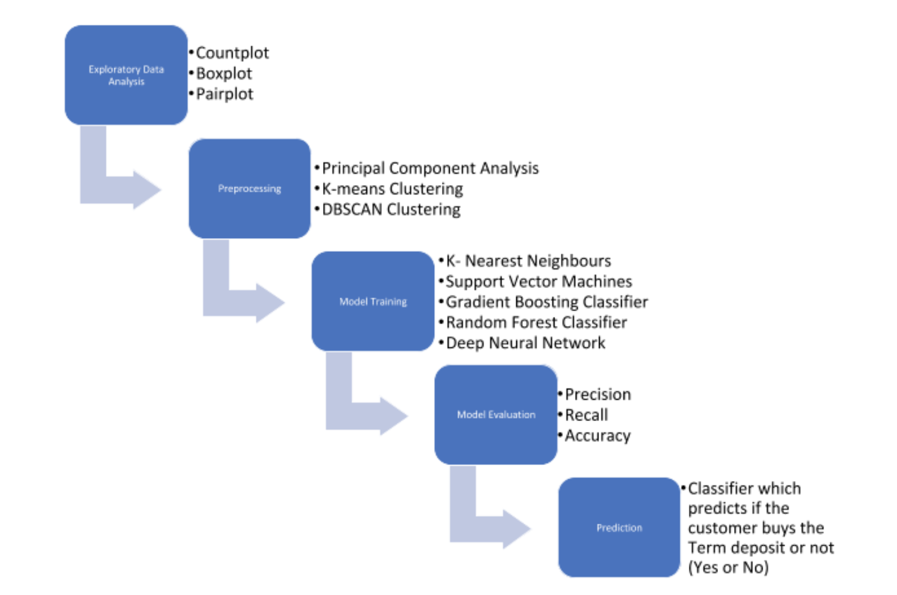

# Project - Bank Marketing Campaign

In today's competitive marketing world, Banks come up with many schemes/packages to attract customers. It would be helpful for the banks to design a scheme if they knew what sector of customers would be intersted in their schemes, so that they can specifically target those customer groups or customize their scheme so that large customer group is included. The goal of our classification model is to predict if a customer would buy their term deposit or not. (where a term deposit is a deposit that a financial institution offers with a high fixed rate and a fixed maturity date). This is for Portuguese banking institution.

### Input Data 
Dataset is from the UCI Machine Learning Repository. Features of this dataset includes:
* Age
* Job type
* Marital status
* Education
* Credit default status
* Average yearly balance
* Mortgage
* Personal loan
* Contact type
* Day of the month
* Month of the year
* Call duration
* Number of contacts
* Days since last contact
* Number of contacts
* Previous campaign outcome
* Output: Opened Term Deposit

### Machine Learning Model Process

Using Pipeline and GridSearchCV with five folds we built five models:
* K-Nearest Neighbor (KNN)
* Support Vector Machine (SVC)
* Random Forest (RFC)
* Gradient Boosting (GBC)
* Deep Neural Network (DNN)

### Comparison of models and Results:

| Classifier | Best Parameters | | Precision | Recall | Accuracy |
| ------------- | ------------- | ------------- | ------------- | ------------- | ------------- |
| KNN  | neighbors: 5, pca components: 28 |  <ul><li>0</li><li>1</li></ul> |  <ul><li>91%</li><li>49%</li></ul> |  <ul><li>97%</li><li>24%</li></ul>  |88.73%  |
| SVM  | pca components: 30, C: 1, gamma: 1e-07, kernel: linear |  <ul><li>0</li><li>1</li></ul> |  <ul><li>91%</li><li>61%</li></ul> |  <ul><li>98%</li><li>26%</li></ul>  |89.83%  |
| Random Forest Classification  | pca components: 34, estimators: 200 |  <ul><li>0</li><li>1</li></ul> |  <ul><li>91%</li><li>58%</li></ul> |  <ul><li>97%</li><li>28%</li></ul>  |89.61%  |
| Gradient Boosting Classifier   | learning rate: 0.1, pca components: 39, estimators: 200 |  <ul><li>0</li><li>1</li></ul> |  <ul><li>92%</li><li>55%</li></ul> |  <ul><li>96%</li><li>36%</li></ul>  |89.54%  |
| DNN  | 1 input layer, 2 hidden layers and 1 output layer |  <ul><li>0</li><li>1</li></ul> |  <ul><li>92%</li><li>50%</li></ul> |  <ul><li>96%</li><li>34%</li></ul>  |88.73%  |

### Conclusion:
SVM produced better results in terms of both Precision/Recall (91/98%) and Accuracy (89.83%) predicting if the customer would buy the term deposit or not. 

